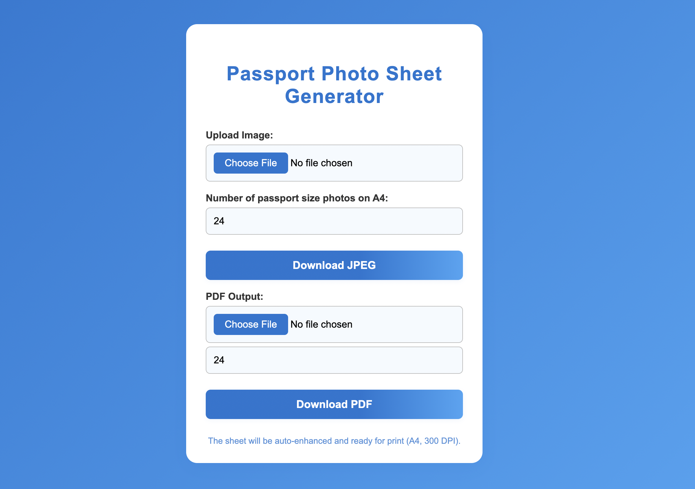

# Passport Photo Sheet Generator



## Live Demo
[https://passportmaker-tau.vercel.app/](https://passportmaker-tau.vercel.app/)

## About
This project is a web-based Passport Photo Sheet Generator. It allows users to upload a photo and instantly generate a printable A4 sheet with multiple passport-sized photos, ready for print. The app also supports PDF output for professional printing.

## Features
- Upload an image and generate a sheet of passport-sized photos (JPEG or PDF)
- Auto-enhancement for optimal print quality
- Fully responsive and modern UI
- Fast, serverless backend powered by Flask and deployed on Vercel

## How to Use
1. Visit the [live site](https://passportmaker-tau.vercel.app/).
2. Upload your photo using the form.
3. Choose the number of passport photos to fit on an A4 sheet.
4. Click "Download JPEG" to get a JPEG sheet, or use the PDF form to get a PDF.
5. Print the downloaded file on A4 paper.

## Tech Stack
- **Frontend:** HTML, CSS (responsive, modern design)
- **Backend:** Python Flask (serverless, Vercel)
- **Image Processing:** Pillow, ReportLab

## Project Structure
```
passport_photo_vercel/
  api/
    app.py
    templates/
      index.html
  requirements.txt
  vercel.json
  README.md
```

## License
MIT
